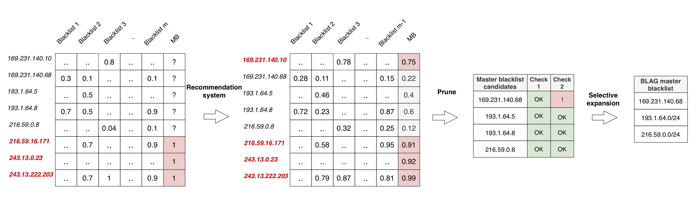

# BLAG: Improving the Accuracy of Blacklists
This repository consists of necessary scripts to run BLAG. Please refer our [paper](https://steel.isi.edu/members/sivaram/papers/BLAG_NDSS.pdf) for more explanation.



## Requirements
`pip install surprise pandas`

[Surprise](http://surpriselib.com/) is a Python package for running recommendation systems.

## Processing blacklists
To obtain the recommended scores for IP addresses in blacklists, there is a preprocessing step that generates
a file known as `processed_blacklists`. Ensure that blacklists are downloaded to a folder containing the heirarchy as shown below:

```
blacklist_folder:
  year:
    month:
      date.zip
```

This is the format that we maintain our blacklist dataset at https://steel.isi.edu/projects/BLAG/data/. A sample folder is present in this repository named blacklists.

To run generate this file, run:

`python process_blacklists.py --start_date "" --end_date "" --blacklist_folder ""`


## Generating recommendation scores
After generating the processed_blacklists file, you can generate recommended scores as follows:

`python blag.py --end_date "" --misclassifications "" --output_file ""`

where misclassifications consists of the file with known misclassifications. A sample misclassifications file is provided in this repository named false_positives.
